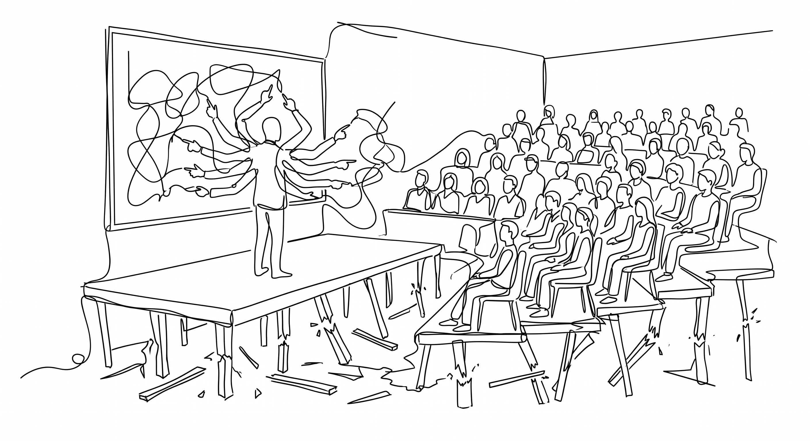

We see names like Francis Galton, Karl Pearson, and Ronald Fisher in almost every statistics textbook. These math giants were vehement protectors and the strongest figures of the eugenics movement. Galton literally coined the term "eugenics." If you are unfamiliar with it, eugenics is the ideology of selective breeding for humans, and it provided the direct foundations and priors for what eventually became Nazi policies. These men were not just the cool, detached nerds we imagine mathematicians to be today. They were ideologues, and their math was largely a tool to justify their politics. Galton, for instance, invented concepts like correlation and regression specifically to explain how supposedly bad genetics, like being poor or having lower intelligence, were passed directly from parents to children.

Galton lived in the Victorian era. Everyone in England at the time was obsessed with heredity. These were colonial times, and these views were considered quite normal and highly moral by the ruling class. Today, dominant western political views feel great guilt about this era and try to correct it. Back then, these men believed they were doing hard, empirical science. They were completely blinded by their own values. Because their statistical methods acted as a literal shield for their core beliefs, they harshly attacked anyone who criticized the math or proposed alternatives. Allowing any room for subjective "priors" or acknowledging a researcher's personal beliefs would completely demolish the purely objective, "data speaks for itself" blind empiricism they held onto so strongly.

The overall consensus today is that those were the dark times of science. We are very kind to people now(!) But even if modern prior beliefs or ideologies are not awful, the exact same mechanism still holds to this day. In most social sciences, the idea that "data speaks for itself" remains. A researcher approaches a subject claiming to be purely empirical and objective, and that stance becomes the shield for their scientific rigor. That is the exact same illusion the eugenicists used. Apart from an industrial study like measuring bolt sizes in a factory, a researcher naturally starts somewhere, holding some beliefs or priors. Where do these hypotheses or theories come from in the first place?

Take the famous power posing study by Amy Cuddy and colleagues [@carney2010power]. They suggested that adopting expansive power poses produces physiological changes, specifically lowering cortisol and increasing testosterone, which then causes behavioral changes. This became incredibly influential, with those TED talks and all. However, larger replication work [@ranehill2015assessing] could not find the same physiological effect, noting only a subjective feeling of power. This is not merely a problem of whether the study is true or wrong. It is a good illustration of this exact problem: just a reasonable theory paired with empirical work. Even though this specific case has an innocent starting point, the structure is quite similar to how eugenics started. The real issue is that researchers were not discovering a novel phenomenon like power-posing effects out of thin air. They were constructing empirical work around an already-conceived causal story. You might argue that this reasonable theory did not come from nowhere, and they built it on other established work. I will remind you that Francis Galton was Darwin's half-cousin, and the basis for his theories had very strong connections at the time too. The takeaway for this power-pose example is obvious. The idea that holding a strong pose easily changes your hormones is a highly peculiar claim. The prior probability of this being true should logically be quite low. We need an immense amount of data to actually change a probability that starts that low.

This illusion of a discrepancy between the researcher's mind and the empirical work creates an odd feeling that scientific claims come out of nowhere. When I read a headline claiming that a specific group of people is more likely to do this or that, my immediate feeling is confusion. Where do these claims actually come from? Saying "science said so" is not a sufficient answer. It is no different than a Victorian statistician saying, "I said nothing, the data said it for itself, these people are inferior based on skull size." We need to see the whole logic, including the prior beliefs and assumptions, that brings us to these conclusions.

