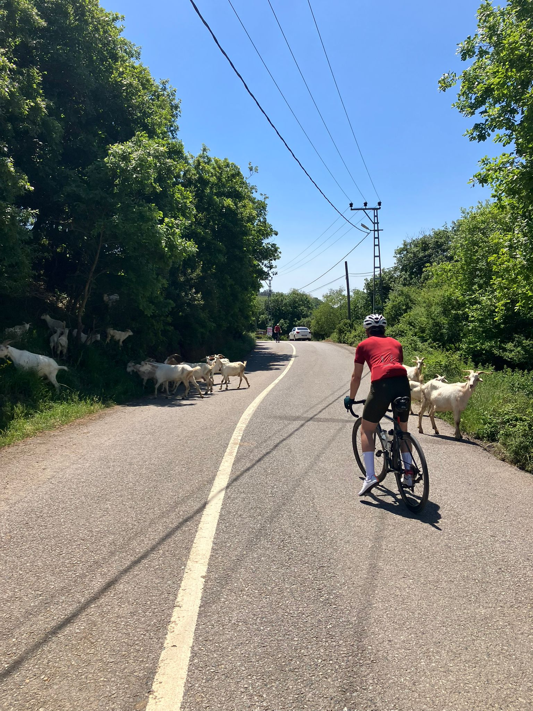

Learning is difficult, and it doesn't get easier. The only thing you realize is that the previous arduous steps seem surprisingly trivial in retrospect.
This amazes me. It is like a paradox, the strenuous effort itself is painful and not immediately rewarding. You just remember the hardship as "huh, how hard this thing was before that I'm doing now as if nothing".
To keep learning and improving, i think we need to have this awareness all the time, otherwise it's just the feeling of difficulty.

This way of thinking lead me to understand that it is *possible*. When you encounter something new (a new topic or a skill), if it is very foreign to you, it may feel like it is impossible to comprehend or to achieve. 
But that is the only way. If it is difficult, I'm in the correct route (most likely). It may sound so trivial when I put it this way but we often miss how learning works and don't recognize it when we avoid this hard effort.

I played video games since I was a kid. If you'd remember, games were more fun and they were objectively more difficult.
I remember that I was grinding and pushing and keep trying when I was playing. It was just part of it. I remember that I was teaching techniques to neighbor's kids older than me to pass a certain level in some game in Atari.
Despite this childhood experience, I was struck with this famous indie game called Hollow Knight: Silksong. I said this is ridiculously hard, why do the developers torture me? I even thought some parts are just impossible for me to complete.
But then, day by day you keep getting better and improve your skills. I’m amazed how parts that once made me want to throw the controller have now become so easy, only with my improvements in skills.

))](hornet.png)

I am not the most athletic type, maybe partly because of too much exercise in video games in my developing years and not so much in the sports.
But tremendous news, it doesn't matter too much if your goal is not become a pro. Even if you feel like inherently you are not good at something, or lack of some prior experience or talent, it is still doable.

{width=50%}

This blog will serve as a documentation of my further learning. Moving forward, my focus will be mostly in the domains of probability, statistics, math, data science, and more generally AI. 
It will definitely feel difficult at times, but let's never forget that embracing the difficulty is the only way to learn and grow.